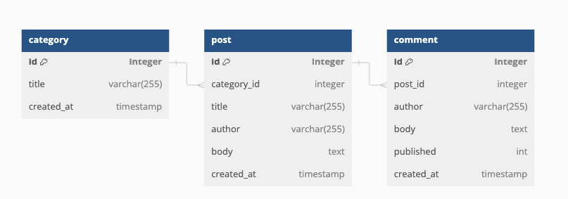

# Instruction for Lab3
The purpose of this Lab assignment is to provide a hands-on experience in developing basic Laravel functionality. It will guide you through basic steps of creating a website, adding routes, controllers, views and models to the application. You will also implement CRUD functionality of a model.

The sample application will be hosted in address `https://lab3.ddev.site`, `https://lab3.test`, `https://www.lab3.dev` -- depending on the development setup on your machine. 

## 1. The empty Laravel project
Pick the appropriate section for your development setup:

- A: DDEV
- B: Wamp\.Net
- C: Laravel Herd
- D: Xampp

### 1.A. DDEV
In your project folder, call the following commands:

```bat
mkdir lab3
cd lab3

ddev config --project-type=laravel --docroot=public --php-version=8.3
ddev get ddev/ddev-phpmyadmin
ddev composer create --prefer-dist --no-install --no-scripts laravel/laravel
ddev composer update
ddev php artisan key:generate
ddev php artisan migrate
ddev start
```

Your site should be available at https://lab3.ddev.site

### 1.B. Wamp\.Net

#### 1.B.1. Command-line PHP
1) Make sure PHP 8.3 (8.2 is also supported) and MySQL services are installed.
2) Access the ["Default Severs" section](https://localhost:7777/settings/default-servers) in Wamp\.Net configuration panel. 
Set a default value for PHP in Command Line, choose PHP 8.3.

In the command line terminal, run the following commands to ensure you have a working command-line PHP. 
It should output PHP version and not display an error message:

```bat
php --version
```

The Lab requires that **[Composer](https://getcomposer.org)** is installed in your computer. 

To check, if Composer is available, run following command line in terminal app of your computer:
```bat
composer --version
```
It should output the actual version number, not an error message. If it is not there, follow the [official installation guidelines](https://getcomposer.org/doc/00-intro.md#installation-windows
).

In ['Sites' section](https://localhost:7777/sites) of the Wamp\.Net control panel, create a new site:
- Domain: lab3.test
- Web server: (the NGINX server you have)
- PHP version: choose PHP 8.3
- Document root: leave the automatic proposal, `c:\Wamp.NET\sites\lab3.test\public`
- Aliases: www

#### 1.B.2. Database for Wamp\.Net setup
Connect to the local MySQL server using the same tool you used in Lab2 - for example MySQL Workbench or PhpMyAdmin.

Using the following script, create a user "lab3" and a database "lab3":

```sql
CREATE USER 'lab3'@'%' IDENTIFIED  by 'lab3';
GRANT USAGE ON *.* TO 'lab3'@'%';
CREATE DATABASE IF NOT EXISTS `lab3`;
GRANT ALL PRIVILEGES ON `lab3`.* TO 'lab3'@'%';
```
#### 1.B.3. Laravel installation in Wamp\.Net setup
In the command line terminal, run the following commands:

```bat
cd c:\Wamp.NET\sites\lab3.test
rmdir public
composer create --prefer-dist --no-install --no-scripts laravel/laravel .
composer update
copy .env.example .env
```
Don't close the terminal window, you will need it very soon!

Open your project in Visual Studio code and edit the `.env` file:
1) update the default DB driver to MySql by setting `DB_CONNECTION=mysql` (it is set to sqlite initially)
2) change the `DB_HOST`, `DB_DATABASE`... keys to these values:

```ini
DB_CONNECTION=mysql
DB_HOST=127.0.0.1
DB_PORT=3306
DB_DATABASE=lab3
DB_USERNAME=lab3
DB_PASSWORD=lab3
```
In the terminal window command line, execute the following:
```bat
php artisan key:generate
php artisan migrate
```
Now you should be able to access the site https://www.lab3.test and see an empty project.

### 1.C. Laravel Herd

#### 1.C.1. Laravel Herd installation
Install Laravel Herd from https://herd.laravel.com/
When you run Herd for the first time, it downloads and installs PHP 8.3 automatically. This also includes command-line support of PHP.

#### 1.C.1. Laravel installation in Wamp\.Net setup
In the sites section, create a new site named "Lab3". You can now access the site at https://lab3.test


### 1.D. XAMPP
Lab3, Lab4 and the course project can technically be made in XAMPP environment, but it would be quite complicated.
It is suggested to move to Laravel Herd, which will make development of Laravel projects much easier.


## 2. Working with the data model
The lab database will have the following data entities: `article`, `category`, `comment`.



### 2.1. Generation of model classes
Use `artisan` command line tool to create the models using the following commands:

```bat
php artisan make:model Category --migration
php artisan make:model Post --migration
php artisan make:model Comment --migration
```
Each command creates several new items:
- model class in *Laravel installation folder*/app/models
- migration file in *Laravel installation folder*/database/migrations


### 2.2. Adding fields to DB migrations
Update the migration files (found in *Laravel installation directory*/database/migrations) created by `artisan` to include data columns:
- file `2024_..._create_categories_table.php`
Edit the `up()` method, add the following after `$table->id()`:
```php
public function up(): void
{
    Schema::create('categories', function (Blueprint $table) {
        $table->id();
        $table->string('title', length: 255);
        $table->timestamps();
    });
}
```
- file `2024_..._create_posts_table.php` 
Edit the `up()` method, add the following after `$table->id()`:
```php
public function up(): void
{
  Schema::create('posts', function (Blueprint $table) {
      $table->id();
      $table->foreignId('category_id')->constrained()->onDelete('cascade');
      $table->string('title', length: 255);
      $table->string('author', length: 255);
      $table->text('body');
      $table->timestamps();
  });
}
```

- file `2024_..._create_comments_table.php` 
Edit the `up()` method, add the following after `$table->id()`:
```php
public function up(): void
{
    Schema::create('comments', function (Blueprint $table) {
      $table->id();
      $table->foreignId('post_id')->constrained()->onDelete('cascade');
      $table->string('author', length: 255);
      $table->text('body');
      $table->boolean('published')->default(false);
      $table->timestamps();
  });
}

```
Using the command line `artisan` tool, execute the migrations to create the initial version of your database:
```bat
php artisan migrate
```
Check the structure of your database. Besides the standard Laravel tables (" failed_jobs", " migrations", " password_reset_tokens"...), you will also find newly created tables "posts", "categories" ," comments".

### 2.3. Foreign key relationships in models
Update your model classes to include references to other models.
Edit files in *Laravel installation directory*/App/models:

- file `Category.php`
```php
<?php

namespace App\Models;

use Illuminate\Database\Eloquent\Factories\HasFactory;
use Illuminate\Database\Eloquent\Model;

class Category extends Model
{
    use HasFactory;
    protected $fillable = ['title'];
    public function posts()
    {
        return $this->hasMany(Post::class);
    }
}

```
- File `Post.php`
```php 
<?php

namespace App\Models;

use Illuminate\Database\Eloquent\Factories\HasFactory;
use Illuminate\Database\Eloquent\Model;

class Post extends Model
{
    use HasFactory;
    protected $fillable = ['title', 'author', 'body'];
    public function category()
    {
        return $this->belongsTo(Category::class);
    }
    public function comments()
    {
        return $this->hasMany(Comment::class);
    }
}
``` 
-File `Comment.php`
```php
<?php

namespace App\Models;

use Illuminate\Database\Eloquent\Factories\HasFactory;
use Illuminate\Database\Eloquent\Model;

class Comment extends Model
{
    use HasFactory;
    protected $fillable = ['body', 'author'];
    public function post()
    {
        return $this->belongsTo(Post::class);
    }

    public function scopePublished($query)
    {
        return $query->where('published', true);
    }
}

```


### 2.4. Filling the model with sample data
Update the *Laravel installation directory*/Database/seeders/DatabaseSeeder.php file to the following. See how there are different approaches for handling relations, but the result is similar:

```php
<?php
<?php

namespace Database\Seeders;

use App\Models\Category;
use App\Models\Post;
use Illuminate\Database\Seeder;

class DatabaseSeeder extends Seeder
{
    /**
     * Seed the application's database.
     */
    public function run(): void
    {
        Category::create(['title' => 'Laravel']);
        Category::create(['title' => 'PHP']);
        Category::create(['title' => 'JavaScript']);
        Category::create(['title' => 'Vue.js']);
        Category::create(['title' => 'React']);

        $laravel_category = Category::where('title', 'Laravel')->first();
        $php_category = Category::where('title', 'PHP')->first();

        Post::create([
            'title' => 'Laravel 11 is released',
            'author' => 'John Doe',
            'body' => 'Laravel 11 is released and it has many new features.',
            'category_id' => $laravel_category->id,
        ]);

        $firstpost = Post::query()->latest()->first();
        //firstpost create 5 comments by different authors with some negative reviews
        $firstpost->comments()->createMany([
            ['body' => 'This is a bad post.', 'author' => 'Jane Doe'],
            ['body' => 'I hate Laravel.', 'author' => 'Brother Joe'],
            ['body' => 'This is a terrible post.', 'author' => 'John Deere'],
            ['body' => 'I dislike Laravel.', 'author' => 'Jane Maria']
        ]);

        //this is the same as the above code
        $post = new Post();
        $post->title = 'PHP 8.4 is in the making';
        $post->author = 'John Doe';
        $post->body = 'PHP 8.4 is in the making and it has many new features.';
        $post->category_id = $php_category->id;
        $post->save();

        //we are using model relationship to add comments
        $post->comments()->createMany([
            ['body' => 'This is a great post.', 'author' => 'John Doe'],
            ['body' => 'I love Laravel.', 'author' => 'Jane Doe'],
        ]);
    }
}
```


<div style="background-color:#faefb6;">

 ### Task 1 

Extend the code of database seeder to:
- add Javascript and CSS to list of categories
- add a new blog post to Javascript and CSS categories
- add one comment to the post about Javascript
- add 75 spam comments to the post about CSS (you might be interested in creating a comment [factory class](https://laravel.com/docs/11.x/eloquent-factories) to achieve that).

Execute the seeder with the following command (keep in mind that the `:fresh` mode means deleting all current data and re-creating data structures):
```bat
php artisan migrate:fresh --seed
```
</div>
## 3. The web application
The navigation in Lab3 web application will start from a list of recent blog posts, providing links to display page of each particular item.

### 3.1. Controller for `posts`
Using artisan, create a resource controller:

```bat
php artisan make:controller PostController --resource
```
It creates a new file `PostController.php` in *Laravel installation folder*\app\Http\Controllers\. Edit the file change its beginning accordingly (leave the other parts of the file intact):

```php
<?php

namespace App\Http\Controllers;

use Illuminate\Http\Request;
use App\Models\Post;
use App\Models\Category;

class PostController extends Controller
{
    /**
     * Display a listing of the blog entries.
     */
    public function index()
    {
        //reads all posts and all categories from the database
        $posts = Post::all()->sortByDesc('created_at');
        $categories = Category::all();
        return view('posts.index', compact('posts', 'categories'));

    }
```
Inside this `index` method, a full list of blog posts is loaded from the database and passed to a view called `posts.index`. To display information about the category of blog post, information from `Categories` table is also needed. So we load it from the database and pass into the view.

## 3. Implementing CRUD operations
### 3.2. View for listing all posts
In the folder *Laravel installation folder*\resources\views, make a subfolder `posts`. Within that folder, create a file `index.blade.php` with the following contents:
```html
<!DOCTYPE html>
<html lang="en">

<head>
    <meta charset="UTF-8">
    <title>Blog page</title>
</head>

<body>

    <h1>Welcome to the programming blog</h1>

    @foreach ($posts as $post)
        <h2><a href="{{ route('posts.show', $post->id) }}">{{ $post->title }}</a></h2>
        <p>An article by <em>{{$post->author}}</em> published on {{$post->created_at->format('d.m.y')}} in category {{ $categories[$post->category_id]->title }}</p>
        <p>{{ $post->body }}</p>
        
    @endforeach

</body>
</html>
```


### 3.3. Routing requests to a controller
To see a list of posts, routing has to be changed.
Edit the file *Laravel installation folder*/routes/web.php

```php
<?php

use Illuminate\Support\Facades\Route;
use App\Http\Controllers\PostController;
use Illuminate\Support\Facades\URL;

Route::redirect('/', '/posts');
Route::resource('posts', PostController::class);

URL::forceScheme('https');
```
1) requests looking for site root (/) are redirected to /post
2) requests looking for /posts/... are served by controller `PostController`.

After this change, you can open the site in a web browser to see a list of two blog posts.


### 3.4. Implementing "CRUD" in the application
#### 3.4.1. Deleting a post
Edit the `PostController.php` file (in *Laravel installation folder*\app\Http\Controllers\ folder) and change the `destroy()` method accordingly:

```php
    public function destroy(string $id)
    {
        Post::findOrfail($id)->delete();
        return redirect()->route('posts.index');
    }
```
In the migration it was set to `cascadeOnDelete()` which means that deleting a post will immediately delete all the comments related to that post (and deleting a category would delete all posts and their comments at once).

To cause the `destroy()` operation, an action button is needed.

Update the `index.blade.php` in *Laravel installation folder*\resources\views\posts and add a delete button in all rows. It will cause a POST request with `_method:DELETE` field in the payload. This will trigger the `DELETE` route in Laravel resource router, and that will call the `destroy()` method in `PostController` class:


```php
<!DOCTYPE html>
<html lang="en">

<head>
    <meta charset="UTF-8">
    <title>Blog page</title>
</head>

<body>

    <h1>Welcome to the programming blog</h1>

    @foreach ($posts as $post)
        <h2><a href="{{ route('posts.show', $post->id) }}">{{ $post->title }}</a></h2>
        <p>An article by <em>{{$post->author}}</em> published on {{$post->created_at->format('d.m.y')}} in category {{ $categories[$post->category_id]->title }}</p>
        <p>{{ $post->body }}</p>
        
        <p><form method="POST" action="{{ route('posts.destroy', $post->id) }}">
            @csrf
            @method('DELETE')
            <button type="submit">Delete post</button>
        </form></p>
        
    @endforeach

</body>

</html>

```
Now open the site in a web browser. Notice the "Delete" butons on the page. See the generated HTML source code to see what the `@csrf` and `@method('DELETE')` helpers actually do. Now try deleting some of the posts.
Don't worry, you can always restore the database state by calling
```bat
php artisan migrate:refresh --seed
```

#### 3.4.2. Viewing a post
To implement a functionality of viewing a single post item, we have to implement the `show(string $id)` method in `PostController`. 
This method will be called whenever someone accesses, for example, this address: `https://lab3.ddev.site/posts/156`. At this moment, the value "156" will be passed into the `show()` method.

Update the `PostController.php` file (in *Laravel installation folder*\app\Http\Controllers\ folder), set the `show` method to this:

```php
    public function show(string $id)
    {
        $post = Post::find($id);      
        return view('posts.show', compact('post'));
    }
```

To make a display page of a post, create a new file called `show.blade.php` in *Laravel installation folder*\resources\views\posts folder.
Set the contents of the file to this:

```php
<!DOCTYPE html>
<html lang="en">
<head>
    <meta charset="UTF-8">
    <meta name="viewport" content="width=device-width, initial-scale=1.0">
    <title>{{$post->title}}</title>
</head>
<body>
    <h1>Show Post</h1>
    <div>
        <h2>{{ $post->title }}</h2>
        <p>{{ $post->content }}</p>
        <p>Author: {{ $post->author }}</p>
        <p>Published at: {{ $post->created_at->format("d.m.Y H:i:s") }}</p>
        <!--Notice how we navigate from Post to its Category simply by accessing a propety value! -->
        <p>Category: {{ $post->category->title }}</p>
        <h3>Comments:</h3>
        <ul>
            @foreach($post->comments as $comment)
                <li>
                    <p>{{ $comment->content }}</p>
                    <p>By: {{ $comment->author }}</p>
                    <p>Posted at: {{ $comment->created_at->format("d.m.Y H:i:s") }}</p>
                </li>
            @endforeach
        </ul>
    </div>
</body>
</html>
```

#### 3.4.3. Editing a blog post
When editing an item, the route is similar to the one for viewing the item - for instance, `https://lab3.ddev.site/posts/2/edit`. 
However, this page will have two sub-statuses:

- the user has just opened the form and Laravel has loaded item information from the database
- the user has entered information and tried to save the item, but there is something wrong with the data. Now, the same form is filled by values coming from HTTP POST, not from database.

To create an edit form, we first need to edit the `PostController.php` file (in *Laravel installation folder*\app\Http\Controllers\ folder) and change its `edit()` and `update()` methods accordingly:

```php
    /**
     * Show the form for editing the post
     */
    public function edit(string $id)
    {
        $post = Post::find($id);
        $categories = Category::all();
        return view('posts.edit', compact('post', 'categories'));
    }

    /**
     * Update the post data in database
     */
    public function update(Request $request, string $id)
    {
        //very basic validation - there shold be at least some data in the fields
        if ($request->title == null || $request->author == null || $request->body == null) {
            //if you deleted everyting - go back and fill it!            
            return redirect()->route('posts.edit', $id);
        }
        //all clear - updating the post!
        $post = Post::find($id);
        $post->title = $request->title;
        $post->author = $request->author;
        $post->body = $request->body;
        $post->save();
        return redirect()->route('posts.show', $id);
    }
```

A new Blade file `edit.blade.php` needs to be created in *Laravel installation folder*\resources\views\posts

```php
<!DOCTYPE html>
<html lang="en">
<head>
    <meta charset="UTF-8">
    <meta name="viewport" content="width=device-width, initial-scale=1.0">
    <title>Edit Post</title>
</head>
<body>
    <h1>Edit Post</h1>

    <form action="{{ route('posts.update', $post->id) }}" method="POST">
        @csrf
        @method('PUT')

        <div>
            <label for="title">Title:</label>
            <input type="text" id="title" name="title" value="{{ $post->title }}" required>
        </div>

        <div>
            <label for="body">Body:</label>
            <textarea id="body" name="body" required cols="80" rows="20">{{ $post->body }}</textarea>
        </div>

         <div>
            <label for="title">Author:</label>
            <input type="text" id="author" name="author" value="{{ $post->author }}" required>
        </div>

        <div>
            <label for="category">Category:</label>
            <select id="category" name="category_id">
                @foreach ($categories as $category)
                    <option value="{{ $category->id }}" {{ $category->id == $post->category_id ? 'selected' : '' }}>
                        {{ $category->title }}
                    </option>
                @endforeach
            </select>
        </div>

        <button type="submit">Update</button>
    </form>
</body>
</html>

```
<div style="background-color:#faefb6;">

 ### Task 2
 Update the `index.blade.php` in *Laravel installation folder*\resources\views\posts to add an `Edit post` button in all rows.

 </div>


 ### 3.4.4. Creating a new post
 <div style="background-color:#faefb6;">

 ### Task 3
 Update the `create()` and `store()` methods of PostController to implement adding a new Post entry. 

 - In the `create()` method you will need to load all categories and pass them to the `posts.create` view.
 - In the `store()` method you will first validate if the blog title, body and author lines are not empty. If everything is correct, you can store the data in the database.

 After you have saved the data, it is a good practice to redirect the user to the display form of the item.

The Blade form will be similar (but may not be identical) to the edit Blade.

Add a link "Create new blog post" to the `posts/index.blade.php` view, at the top of the page.
 </div>