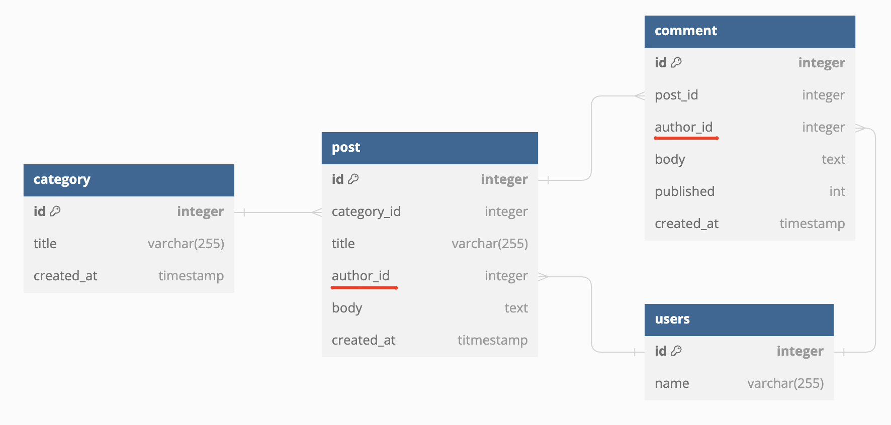

# Instruction for Lab4

The lab is based on the outcome of Lab3. The aim is to add authentication and  authorization to the blog site.

The assignment can be completed using DDEV, Laravel Herd, Wamp.Net and other web servers. The instruction is prepared for DDEV environment.

## Adding user authentication
You will use Laravel Breeze for user authentication. Open your project in Visual Studio code, open a terminal/command line window.

Install Laravel Breeze according to official instructions https://laravel.com/docs/11.x/starter-kits#laravel-breeze-installation (`composer install`, `php artisan breeze:install`, `php artisan migrate`, `npm install`, `npm run dev`).

Don't forget to prefix all commands with "ddev", that is, in DDEV environment `composer install` can be called `ddev composer install`.

Change the DDEV configuration to fix problem of `vite` tool, following this blog post: https://mtillmann.blog/posts/laravel-10-on-ddev-with-vite-and-breeze.html.

The Breeze installer changes the routing file `./routes/web.php` by adding its specific routes. Add back back the original lines (`Route::redirect ...`, `Route::resource...`, `URL::forceScheme...`) that you created during Lab3 (https://github.com/rauhvargers/TTII_2024_labs/tree/Lab3?tab=readme-ov-file#33-routing-requests-to-a-controller)


## Updates to data model
In the Lab3, post and comment authors were stored as plain text strings. In this Lab assignment, the approach is different - all user information is stored in table "Users" and other tables have ar reference to it.



Make an new migration for updating the structure:

  ``` CMD
  ddev php artisan make:migration converting-to-user-references
  ```


Edit the migration file and set its contents to (it is adding new columns `author_id` to `posts` and `comments` tables, and removing the `author` columns):

``` PHP
<?php

use Illuminate\Database\Migrations\Migration;
use Illuminate\Database\Schema\Blueprint;
use Illuminate\Support\Facades\Schema;

class ConvertingToUserReferences extends Migration
{
    public function up()
    {
        Schema::table('posts', function (Blueprint $table) {
            $table->foreignId('author_id')->constrained('users')->onDelete('cascade');
        });
        Schema::table('comments', function (Blueprint $table) {
            $table->foreignId('author_id')->constrained('users')->onDelete('cascade');
        });
        Schema::table('posts', function (Blueprint $table) {
            $table->dropColumn('author');
        });
        Schema::table('comments', function (Blueprint $table) {
            $table->dropColumn('author');
        });
    }

    public function down()
    {
        Schema::table('posts', function (Blueprint $table) {
            $table->dropForeign(['author_id']);
            $table->dropColumn('author_id');
        });
        Schema::table('comments', function (Blueprint $table) {
            $table->dropForeign(['author_id']);
            $table->dropColumn('author_id');
        });
    }
}
```
 
> [!IMPORTANT]
> ### Task 1
> Update the existing code to read and fill the newly added columns:
>  - Change the `Models/Post`, `Models/Comment` and `Models/User` to add model navigation methods for "Belongs To" and "Has Many" relations;
> - Change the `app/resources/views` files to use the new column (e.g., the Blade call to `{{$post->author}}` now should be replaced by `{{ post->author->name }}`). 
The "new item" and "edit item" forms allow typing in author's name. These should be replaced by a drop-down menu with a list of all available users;
>  - Change your `PostController` class (`update`, `create` methods) to handle with user ID-s instead of author name strings;
> - Update and extend the database seeder (you will want to first seed the `Users` table; it is well described in Laravel documentation: https://laravel.com/docs/11.x/seeding#writing-seeders)
> 
> After updating the database seeder, run `ddev php artisan migrate:fresh --seed`.

Now the Laravel Breeze's authorization functionality can be used.

> [!IMPORTANT]
> ### Task 2
> The home page of the blog page - https://lab3.dev.site/posts displays a list of blog entries and shows controls for deleting or editing items, link for adding new buttons.
> - The "New item" button should not be visible to unauthorized visitors. Hide the controls, using `@auth` directive in Breeze.
> - `Edit` and `Delete` buttons should only be visible to the author of each post. Make a gate `update-post`  in `app/Providers/AppServiceProvider.php` that compares the ID of post's user with the one of current user. Apply the appropriate `@can(...)` calls it the Blade templates. (Laravel documentation provides a very similar gate function as an example: https://laravel.com/docs/11.x/authorization#writing-gates)
> - Change `PostController` class methods `update`, `create`; add calls to `update-post` gate before actually changing the data (again, Laravel documentation has a good example on that: https://laravel.com/docs/11.x/authorization#writing-gates)

The remainder of Lab4 is optional and will not be graded. Feel free to perform the tasks at will.

> [!IMPORTANT]
> ### Task 3 (optional)
> - Install the Laravel Spatie authorization library. To avoid weird behavior of the app, don't forget to execute the  `ddev php artisan config:clear` as described in https://spatie.be/docs/laravel-permission/v6/installation-laravel, .
> - Extend the application so that it has two user roles - Editors and Admins. 
> - Update your database seeder classes, assign some users the Editor role and at least one user - the Admin role.
> - Change your gate functions to add a check if the current user is a member of Admin role. If true, allow such user to edit items of other users, too.